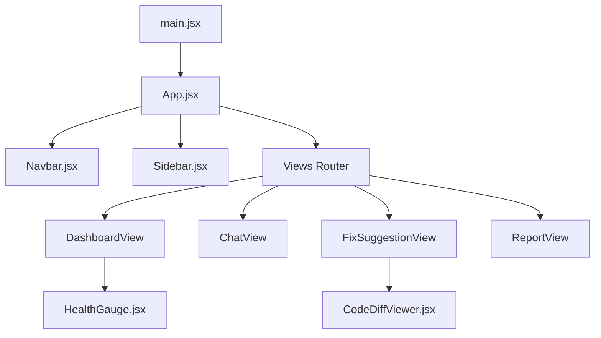

<div align="center">

# ⚡ CodeLens AI — Advanced Code Intelligence & Repository Auditor


**A state-of-the-art, enterprise-grade developer productivity platform engineered to seamlessly monitor, audit, refactor, and secure complex codebases in real time.**

[](https://react.dev/)
[](https://vitejs.dev/)
[](https://tailwindcss.com/)
[](LICENSE)

</div>

---

## 📖 About The Project

**CodeLens AI** is an intelligent assistant platform designed for modern software engineering teams. It bridges the gap between raw code and automated code health analysis. By combining real-time repository metrics, AI chat assistance, automated bug detection, and precise code diff visualizations, CodeLens AI empowers developers to write cleaner, safer, and more efficient code.

---

## ✨ Comprehensive Features & Capabilities

* **📊 Interactive Dashboard & Health Gauge:**
  * Real-time circular health score meter (e.g., 94/100 code quality rating).
  * Instant metrics tracking for code smells, technical debt, and memory leak warnings.

* **🔍 Issues & Fix Suggestions Viewer:**
  * Automated scanning and categorization of critical errors, warnings, and code smells.
  * **Interactive Code Diff Viewer:** Side-by-side comparison tool highlighting exact modifications (`Original / Before` vs `Optimized / After`) with custom color-coded syntax highlights.

* **🛡️ Security & Vulnerability Audit:**
  * Deep scans across dependency trees and code layers to detect security risks and exposed API credentials.

* **🤖 AI Chat Assistant with Quick Action Chips:**
  * Fully responsive conversational AI interface equipped with rapid prompt shortcuts (*"🔍 Explain this error log"*, *"⚡ Optimize performance"*, *"🛡️ Check security"*, *"🧪 Write unit tests"*).

* **📦 Tech Stack & Dependency Analyzer:**
  * Complete, organized inventory of frameworks, libraries, plugins, and tools powering the repository.

* **📄 Markdown Exportable Audit Reports:**
  * One-click client-side report generator utilizing Blob APIs to export detailed code health sheets directly as downloadable `.md` files.

* **🌓 Persistent Dark/Light Mode Theme:**
  * Fully integrated responsive styling with smooth custom keyframe animations and persistent local storage theme switching.

---

## 🛠️ Complete Tech Stack & Tools Used

Yahan aapke project mein use hone wali har ek technology aur library ki complete list di gayi hai:

| Category | Technology / Library | Purpose / Role |
| :--- | :--- | :--- |
| **Frontend Core** | React.js (v18+) | Component-based UI architecture & virtual DOM rendering |
| **Build System** | Vite | Lightning-fast module bundling & Hot Module Replacement (HMR) |
| **Styling Framework** | Tailwind CSS | Utility-first responsive styling, custom animations & dark mode |
| **Iconography** | Lucide React | Modern, clean, scalable vector icons across all app views |
| **State & Storage** | React Hooks (`useState`, `useEffect`) | Local state management & persistent UI preferences |
| **Diff Engine** | Custom Code Diff UI | Side-by-side comparison of code refactoring results |
| **Export Engine** | Browser Blob API | Client-side generation and downloading of `.md` reports |

---

## 📂 Project Architecture & Folder Structure

Aapke project ka complete directory structure aur file organization kuch is tarah hai:

```text
codelens-ai/
├── 📁 public/                 # Static assets, icons, and favicon
├── 📁 src/
│   ├── 📁 components/         # Reusable modular UI components
│   │   ├── CodeDiffViewer.jsx # Side-by-side code changes diff tool
│   │   ├── HealthGauge.jsx    # Circular code health score meter
│   │   ├── Navbar.jsx         # Top navigation bar with theme toggle & actions
│   │   └── Sidebar.jsx        # Navigation sidebar for switching views
│   ├── 📁 data/               # Mock data sources & repository configs
│   │   └── mockData.js        # Repository issues, code snippets, and metrics
│   ├── 📁 views/              # Main page views / routing screens
│   │   ├── AuthView.jsx       # Authentication & login screen
│   │   ├── ChatView.jsx       # AI assistant chat interface with quick prompt chips
│   │   ├── DashboardView.jsx  # Main summary and repository health overview
│   │   ├── FixSuggestionView.jsx# AI-recommended code fixes & diff previews
│   │   ├── IssuesView.jsx     # Detected bugs, warnings, and code smells list
│   │   ├── LandingView.jsx    # Welcome and product introduction screen
│   │   ├── ReportView.jsx     # Comprehensive audit report & Markdown report export
│   │   ├── SecurityView.jsx   # Security vulnerability audit panel
│   │   └── TechStackView.jsx  # Detected technologies and package dependencies
│   ├── App.jsx                # Main application component & layout controller
│   ├── index.css              # Global styles & Tailwind CSS directive imports
└── └── main.jsx               # React DOM entry point
```

---

### 🗺️ Visual Architecture Flow



---

## ⚙️ Installation & Local Setup

Apne local machine par CodeLens AI ko run karne ke liye in simple steps ko follow karein:

### 1. Prerequisites
Ensure karein ki aapke system par **Node.js** (v16 ya higher) installed hai.

### 2. Navigate to Project Directory
```bash
cd codelens-ai
```

### 3. Install Dependencies
```bash
npm install
```

### 4. Run Development Server
```bash
npm run dev
```
*Yeh command aapke browser ke liye ek local development server start karegi (e.g., `http://localhost:5173`).*

### 5. Build for Production
```bash
npm run build
```

---

## 🤝 Contributing

Contributions, issues, and feature requests are always welcome! Feel free to open an issue or submit a pull request.

1. Fork the Project
2. Create your Feature Branch (`git checkout -b feature/AmazingFeature`)
3. Commit your Changes (`git commit -m 'Add some AmazingFeature'`)
4. Push to the Branch (`git push origin feature/AmazingFeature`)
5. Open a Pull Request

---

## 📝 License

Distributed under the **MIT License**. See `LICENSE` for more information.

<div align="center">
  <p>Crafted with ❤️ by Anjali Thakur Prerna, Yamini, Mitali, , Kasis for advanced software code intelligence.</p>
</div>
