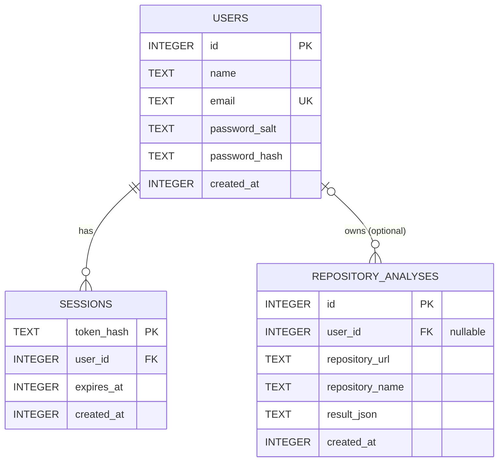

# CodeLens AI Database ER Diagram

This diagram documents the SQLite schema initialized by `database.py`.

## Relationships and constraints

- A user can have multiple sessions. Deleting the user deletes their sessions (`ON DELETE CASCADE`).
- A user can have multiple saved analyses. `user_id` is nullable so anonymous scans can be saved; deleting a user preserves scan rows and sets their `user_id` to `NULL` (`ON DELETE SET NULL`).
- `users.email` is unique and case-insensitive.
- Session tokens are not stored in plain text; `token_hash` is the primary key.
- Times are Unix timestamps in seconds. `result_json` stores the analysis response as JSON text.
- Indexes support removing expired sessions and listing recent analyses by user.
